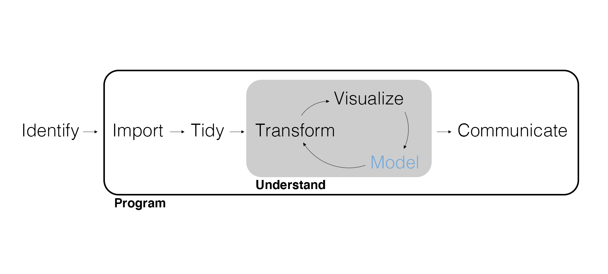
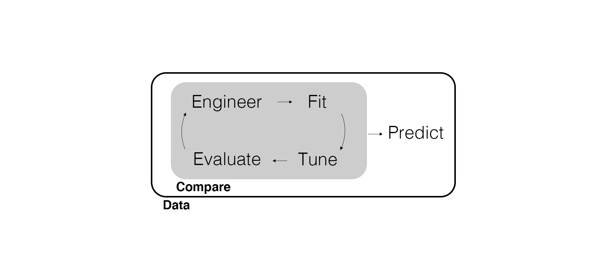

## Thoughts on Uncertainty

Meet Judea Pearl - a Jewish computer scientist born in the 1930s. He has contributed significantly to the development of causal inference methods.

<center>
{width=200px}
</center>

## An Example of a Peacemaker

- In 2002, Pearl's son Daniel was murdered in Pakistan.
- In response, Pearl helped found the *Daniel Pearl Foundation*, an organization dedicated to fostering cross-cultural understanding and tolerance.
- When asked why he was working for reconciliation between Jews and Muslims Pearl stated, "Hate killed my son. Therefore I am determined to fight hate."

## Holding on to Two Truths

- We can hold firm to our beliefs in gospel truths
- We can love and respect others who may not feel the same way

3 Nephi 12:19: "And blessed are all the peacemakers, for they shall be called the children of God."

Matthew 5:43-44: "Ye have heard that it hath been said, Thou shalt love thy neighbour, and hate thine enemy. But I say unto you, Love your enemies, bless them that curse you, do good to them that hate you, and pray for them which despitefully use you, and persecute you."

## And Regarding Uncertainty...

> "And now as I said concerning faith -- faith is not to have a perfect knowledge of things; therefore if ye have faith ye hope for things which are not seen, which are true." -Alma 32:21

- Faith operates under uncertainty.
- Uncertainty is a feature of life, not a flaw.
- It's **okay** to be uncertain.

## The Lord Gives us Knowledge According to Our Needs

2 Nephi: 28: "For behold, thus said the Lord God: I will give unto the children of men line upon line, precept upon precept, here a little and there a little; and blessed are those who hearken unto my precepts, and lend an ear unto my counsel, for they shall learn wisdom...."

"Lead kindly Light, amid th'encircling gloom...The night is dark and I am far from home...Keep thou my feet; I do not ask to see the distant scene - one step enough for me."

## So How Do We Manage Uncertainty?

"My dear brothers and sisters, my call to you [today] is to *start today* to increase your faith. Through your faith, Jesus Christ will increase your ability to move the mountains in your life, even though your personal challenges may loom as large as Mount Everest. Your mountains may be loneliness, doubt, illness, or other personal problems. Your mountains will vary, and yet the answer to each of your challenges is to increase your faith."

President Russell M. Nelson, April 2021 General Conference.

## So How Do We Manage Uncertainty?

"Please know this: if everything and everyone else in the world whom you shold trust should fail, Jesus Christ and His Church will *never* fail you. The Lord never slumbers, nor does He sleep. He 'is the same yesterday, today, and [tomorrow].' He will not forsake His covenants, His promises, or His love for His people. He works miracles today, and He will work miracles tomorrow."

President Russell M. Nelson, April 2021 General Conference.

## Marketing Analytics Process

<center>
{width=900px}
</center>

---

{width=500px}
## Motivating Example

Suppose you work as a marketing analyst for Roomba. You are responsible for investigating the brand’s health, 
including predicting customer churn, identifying customer segments, and tracking the topics
of customer discussions. To accomplish this, you use a variety of data, including surveys
and reviews. How can you make these kinds of predictions?


## Prediction

Models *extract information* from the data to inform our managerial decision. While data wrangling and visualization can *suggest* patterns of interest, a predictive model is often needed.

- To predict means "to estimate something that will happen."
- Predictive modeling may also be referred to as **machine learning** given its ties to computer science.
- We use predictive models to accurately predict an outcome or cluster observations.

Predictive models are often called “black boxes,” meaning we can see what goes in and what comes out, but it’s hard to fully explain every step inside.

## Predictors and Outcome Variables

In predictive modeling, we use some variables called predictors or explanatory variables to predict others, known as outcome or response variables. For example, a customer’s past purchase history and income might be used to predict their future purchases.

## Your Turn!

Turn to the person next to you and work together to come up with another example of explanatory and response variables in a marketing context.

## Solution

Possible examples could include:

- Response variable: How much the customer will spend on the website this month. Explanatory variables: number of website visits, time spent on site, previous purchase amounts.
- Response variable: Customer lifetime value (CLV). Explanatory variables: average order value, purchase frequency, customer tenure.

## Supervised vs. Unsupervised Learning

In this unit, we’ll look at examples of **supervised learning**, where we aim to predict a specific outcome variable, as well as **unsupervised learning**, where we look for patterns or groupings among predictors without focusing on a particular outcome.

## Predictive Modeling Workflow

<center>
{width=900px}
</center>

## Engineer | Engineer the Features or Predictors

We often need to modify the predictors to make them easier for the model to use. This is called **feature engineering**. We applied a similar concept when we prepared our data for summary in the previous unit. For example, we might turn a customer’s birthdate into an age variable or combine several purchase-related columns into a single spending score.

## Fit | Using tidymodels

The **tidymodels** framework is a collection of packages for modeling using tidyverse principles. The goal is to provide the same consistency and ease-of-use for modeling that the tidyverse provides for importing, wrangling, visualizing, and reporting data.

```{r}
# Load packages.
library(tidymodels)
```

## Fit | Specify the Model Type and Engine

In the tidymodels framework, we specify the model **type** and then set the **engine** we'd like to estimate the model with. The engine is typically another R package that would normally require its own unique syntax.

This allows us to use a variety of modeling packages and languages while keeping the same syntax.

```{r}

# An example of specifying the model type and engine.

decision_tree() |> 
  set_engine("rpart")

```

---

Occasionally, we may also need to specify the model **mode** (e.g., regression or classification).

## Tune and Evaluate | Tune Model Hyperparameters

Predictive models typically have a number of **hyperparameters** that can be modified to improve prediction. We typically just run lots of models and see what works best.

This process is called **tuning** and will require us to consider training, testing, and **validation data**.

## Tune and Evaluate | Predictive Fit

When checking how well our model performs, our goal is to find patterns in the data that work well on new data, not just the data we already have. We want the model to learn general, useful features rather than memorizing every detail. If a model memorizes too much (called **overfitting**), it might do well on the training data but make bad predictions on new data. By learning broader patterns, we can make more accurate predictions in the future.

## Predict | Apply the Model

Once we have a best-fitting model, and we typically end up comparing *many* models, we use it to predict outcomes or cluster objects.

## Iteration

Since we're going to be **iterating** a lot throughout this process, it's time to learn some more advanced programming options. A good rule of thumb is if you have to copy and paste something more than twice you should consider coding the iteration.

First, let's use a **for loop**.

```{r}
empty_vector <- vector(mode = "double", length = 7)
for (i in seq_along(empty_vector)) {
  empty_vector[i] <- 1 + i
}

empty_vector
```

## Your Turn!

Modify the for loop to return a vector of only zeros.

## Solution

```{r}
empty_vector <- vector(mode = "double", length = 7)
for (i in seq_along(empty_vector)) {
  empty_vector[i] <- 0
}

empty_vector
```


## Conditional Statements

Sometimes you want code to run only when certain conditions are met. To do this, use **conditional statements**. Note that these are a separate idea from for loops, but a for loop can be a great place to use them!

```{r}
empty_vector <- vector(mode = "double", length = 7)
for (i in seq_along(empty_vector)) {
  if (i == 1) {
    empty_vector[i] <- 1
  } else {
    empty_vector[i] <- 1 + empty_vector[i - 1]
  }
}

empty_vector
```

---

We can can condition on many possible values.

```{r}
empty_vector <- vector(mode = "double", length = 7)
for (i in seq_along(empty_vector)) {
  if (i == 1) {
    empty_vector[i] <- 0
  } else if (i == length(empty_vector)) {
    empty_vector[i] <- 0
  } else {
    empty_vector[i] <- 1 + empty_vector[i - 1]
  }
}

empty_vector
```

## Functions

While a for loop is a powerful way to code an iteration and conditional statements give us even more flexibility, we might still need to copy and paste code to perform a task multiple times. In that case, we often want to use a **function**.

```{r}
multiply_xy <- function(x, y = 2) {
  return(x * y)
}

multiply_xy(2)

multiply_xy(x = 2, y = 4)
```

---

A few things to note:

- The arguments can include defaults. What happens if you try to call the function without any input?
- Variables defined inside a function aren't *automatically* accessible outside and vice versa.
- Remember to use `return()` to get back a specific output or object.

## Wrapping Up

*Summary*

- Introduced predictive modeling
- Discussed the differences between supervised and unsupervised learning.
- Reviewed the predictive modeling workflow.
- Looked at a few advanced programming features associated with iteration.

*Next Time*

- A classification model.

## Exercise 8

1. Respond to the following prompt (no more than 1 page):  
*You’ve been hired by Roomba to improve their customer analytics efforts. You have access to a variety of data, including surveys and reviews. What variables might serve as explanatory and response variables? Describe how these insights could help Roomba make better marketing decisions.*
2. In the same Quarto document, write a function that uses conditional statements and a for loop. Call it and print the output.
3. Render the Quarto document into Word and upload to Canvas.

