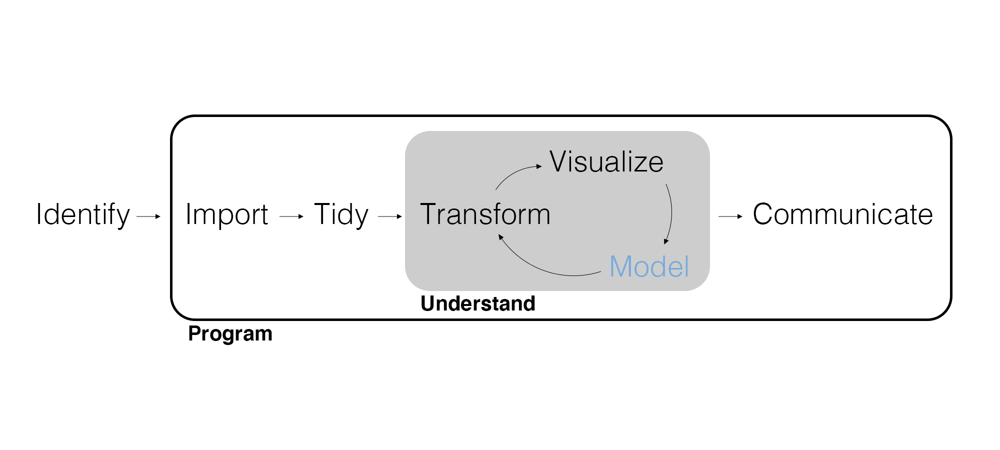
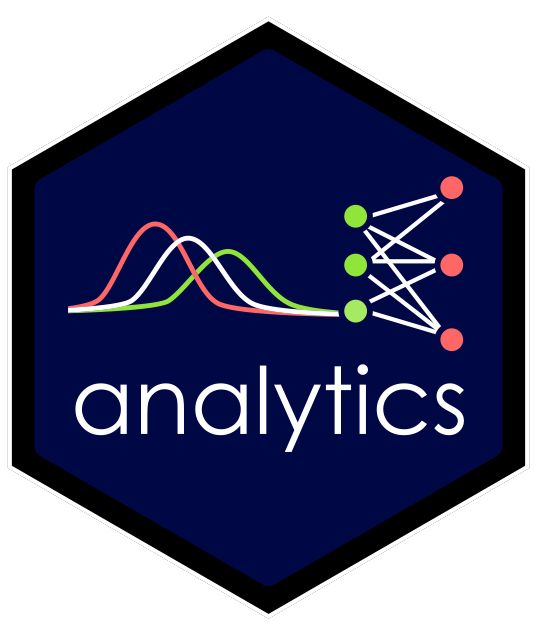
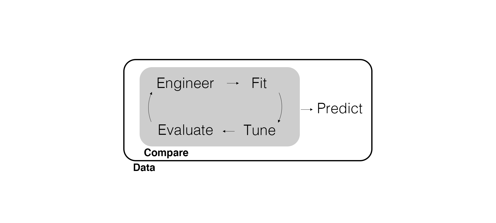

## Final thoughts on Causality and Uncertainty

Meet Judea Pearl - a Jewish computer scientist born in the 1930s. He has contributed significantly to the development of causal inference methods.

<center>
{width=200px}
</center>

## An Example of a Peacemaker

- In 2002, Pearl's son Daniel was murdered in Pakistan.
- In response, Pearl helped found the *Daniel Pearl Foundation*, an organization dedicated to fostering cross-cultural understanding and tolerance.
- When asked why he was working for reconciliation between Jews and Muslims Pearl stated, "Hate killed my son. Therefore I am determined to fight hate."

## Holding on to Two Truths

- We can hold firm to our beliefs in gospel truths
- We can love and respect others who may not feel the same way

3 Nephi 12:19: "And blessed are all the peacemakers, for they shall be called the children of God."

Matthew 5:43-44: "Ye have heard that it hath been said, Thou shalt love thy neighbour, and hate thine enemy. But I say unto you, Love your enemies, bless them that curse you, do good to them that hate you, and pray for them which despitefully use you, and persecute you."

## And Regarding Uncertainty...

> "And now as I said concerning faith -- faith is not to have a perfect knowledge of things; therefore if ye have faith ye hope for things which are not seen, which are true." -Alma 32:21

- Faith operates under uncertainty.
- Uncertainty is a feature of life, not a flaw.
- It's **okay** to be uncertain.

## The Lord Gives us Knowledge According to Our Needs

2 Nephi: 28: "For behold, thus said the Lord God: I will give unto the children of men line upon line, precept upon precept, here a little and there a little; and blessed are those who hearken unto my precepts, and lend an ear unto my counsel, for they shall learn wisdom...."

"Lead kindly Light, amid th'encircling gloom...The night is dark and I am far from home...Keep thou my feet; I do not ask to see the distant scene - one step enough for me."

## So How Do We Manage Uncertainty?

"My dear brothers and sisters, my call to you [today] is to *start today* to increase your faith. Through your faith, Jesus Christ will increase your ability to move the mountains in your life, even though your personal challenges may loom as large as Mount Everest. Your mountains may be loneliness, doubt, illness, or other personal problems. Your mountains will vary, and yet the answer to each of your challenges is to increase your faith."

President Russell M. Nelson, April 2021 General Conference.

## So How Do We Manage Uncertainty?

"Please know this: if everything and everyone else in the world whom you shold trust should fail, Jesus Christ and His Church will *never* fail you. The Lord never slumbers, nor does He sleep. He 'is the same yesterday, today, and [tomorrow].' He will not forsake His covenants, His promises, or His love for His people. He works miracles today, and He will work miracles tomorrow."

President Russell M. Nelson, April 2021 General Conference.

## Marketing Analytics Process

<center>
{width=900px}
</center>

---

{width=500px}

## Prediction

Remember that models *extract information* from the data to inform our managerial decision. While data wrangling and visualization can *suggest* patterns of interest, a model is often needed.

How we model the data depends on if we care about *inference* or only about **prediction**.

- To predict means "to estimate something that will happen."
- Predictive modeling may also be referred to as **machine learning** given its ties to computer science.
- We use predictive models to accurately predict an outcome or cluster observations.

While we can use inferential models to predict, predictive models are black boxes that *cannot* be used to understand the unobserved data generating process.

---

There is substantial overlap between statistical modeling and machine learning.

- *Regression* where the outcome is continuous often uses linear regression.
- *Classification* where the outcome is binary often uses logistic "regression."

Both are examples of **supervised learning**, where there is an outcome variable to predict. We'll also explore **unsupervised learning**, where we group together predictors (a.k.a., explanatory variables) without an outcome.

## Predictive Modeling Workflow

<center>
{width=900px}
</center>

## Engineer | Engineer the Features or Predictors

We often need to modify the predictors to make it easier for the model to use. We called this *preprocessing*, but we'll now refer to it as **feature engineering**.

Instead of being motivated by theory, anything goes in feature engineering as long as we get better predictions. This is both liberating and frightening.

- We no longer have to worry about inference.
- We no longer have statistical frameworks to guide us.

## Fit | Specify the Model Type and Engine and Fit

Once again we specify the model and engine and fit the model. When we *fit* the model (a.k.a., training, calibrating, or estimating the model) we no longer care about (or can typically even get) parameter estimates.

Occasionally, we may also need to specify the model **mode** (e.g., regression or classification).

## Tune | Tune Model Hyperparameters

Predictive models typically have a number of **hyperparameters** that can be modified to improve prediction. Without theory to guide us, we typically just run lots of models and see what works best.

This process is called **tuning** and will require us to consider training, testing, and **validation data**.

## Evaluate | Predictive Fit

Our goal with predictive models is to **learn regular features** from the data (i.e., not overfit) to make accurate predictions.

Prediction. Prediction. Prediction.

## Predict | Apply the Model

Once we have a best-fitting model, and we typically end up comparing *many* more models, we use it to predict outcomes or cluster objects.

Note that there is no more counterfactual predictions. That was in the realm of causal inference where we sought to understand and intervene in some unobserved data generating process.

With predictive models, we generate predictions using test data **as-is**. We do not create custom counterfactual data.

## Iteration

Since we're going to be **iterating** a lot, it's time to learn some more advanced programming options. A good rule of thumb is if you have to copy and paste something more than twice you should consider coding the iteration.

First, let's use a **for loop**.

```{r}
empty_vector <- vector(mode = "double", length = 7)
for (i in seq_along(empty_vector)) {
  empty_vector[i] <- 1 + i
}

empty_vector
```

## Conditional Statements

Sometimes you want code to run only when certain conditions are met. To do this, use **conditional statements**. Note that these are a separate idea from for loops, but a for loop can be a great place to use them!

```{r}
empty_vector <- vector(mode = "double", length = 7)
for (i in seq_along(empty_vector)) {
  if (i == 1) {
    empty_vector[i] <- 1
  } else {
    empty_vector[i] <- 1 + empty_vector[i - 1]
  }
}

empty_vector
```

---

We can can condition on many possible values.

```{r}
empty_vector <- vector(mode = "double", length = 7)
for (i in seq_along(empty_vector)) {
  if (i == 1) {
    empty_vector[i] <- 0
  } else if (i == length(empty_vector)) {
    empty_vector[i] <- 0
  } else {
    empty_vector[i] <- 1 + empty_vector[i - 1]
  }
}

empty_vector
```

## Functions

While a for loop is a powerful way to code an iteration and conditional statements give us even more flexibility, we might still need to copy and paste code to perform a task multiple times. In that case, we often want to use a **function**.

```{r}
multiply_xy <- function(x, y = 2) {
  return(x * y)
}

multiply_xy(2)

multiply_xy(x = 2, y = 4)
```

---

A few things to note:

- The arguments can include defaults. What happens if you try to call the function without any input?
- Variables defined inside a function aren't *automatically* accessible outside and vice versa.
- Remember to use `return()` to get back a specific output or object.

## FAQ | How do I study for a class like this?

1. Seek learning by study and faith (D&C 109:7).
2. Prepare for class by previewing material and coming with questions.
3. Actively code, take notes, and ask questions during class.
4. Practice coding by completing exercises, referencing supplementary material as needed.
5. Review exercise solutions and note where and why your work differs.
6. Use the quizzes to gauge how well the material is understood.
7. Work with classmates and utilize office hours.
8. Download and organize all course materials, notes, and code.

## Wrapping Up

*Summary*

- Reviewed the differences between inference and prediction.
- Discussed the differences between supervised and unsupervised learning.
- Reviewed the predictive modeling workflow.
- Looked at a few advanced programming features associated with iteration.

*Next Time*

- Another classification model.

## Exercise 15

1. Read the case and write how you might meet the expectations (no more than one page) in Quarto.
2. In the same Quarto document, write a function for simulating data that uses conditional statements and a for loop. Call it and print the output.
3. Render the Quarto document into Word and upload to Canvas.

